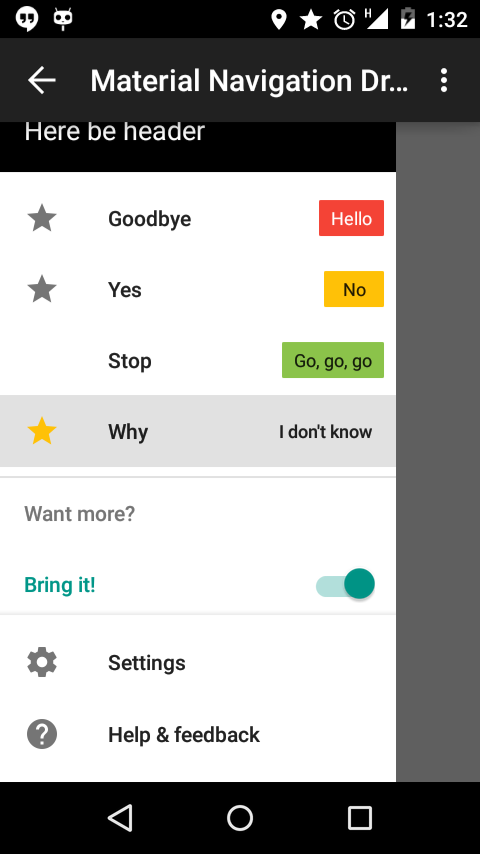
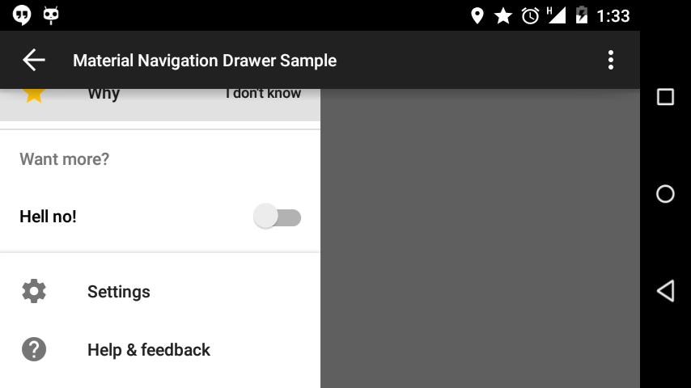
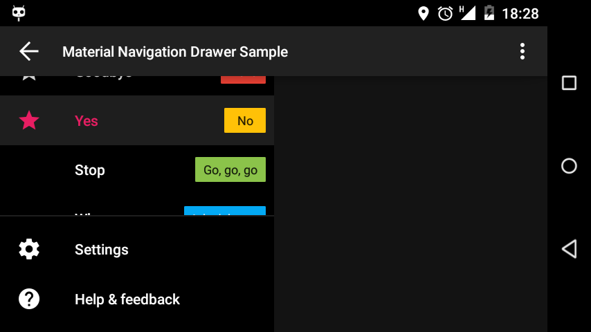

Material Navigation Drawer
==========================

Navigation Drawer according to Material Design spec.

How it works
------------

 - Icon color defaults to `android:textColorSecondary` when not selected. See `SimpleNavigationItemDescriptor` or `BaseNavigationItemDescriptor`.
 - Text color and selected icon color defaults to `android:textColorPrimary`. See `SimpleNavigationItemDescriptor` or `BaseNavigationItemDescriptor`.
 - Activated background is set to 12% of `android:colorForeground`. This currently limits the use to white drawer on white theme or black on black.
 - List background is set to `android:colorForegroundInverse` by default.
 - Divider color is 12% of `android:colorForeground`. You cannot change this currently.

Please note that this is not a drawer per se, the fragment can be used as a pinned side bar (e.g. on 10" tablets). For usage example see the `sample `directory.

Minimum API is 11, because activated selector is introduced just then. As recommended minimum is API 14, lowering the requirements is not planned.

To use this library add the following to your module's `build.gradle`:
```groovy
dependencies {
    compile 'net.xpece.material:navigation-drawer:0.4.1@aar'
}
```

The project currently depends on support-v4 library version 21.0.3.

Customization
-------------

**The drawer has too big right margin!**

As of support-v4 library 21.0.3 there is a hardocded margin of 64dp in a `DrawerLayout`. Use `NavigationDrawerUtils.fixMinDrawerMargin(DrawerLayout)` to remove this limitation. Use this right after you obtain a drawer layout instance typically in `Activity.onCreate(Bundle)`. Why is this an issue? Specs say the margin should be only 56dp on phones.

**I want the drawer to have a standard width!**

To set proper drawer width according to specs call `NavigationDrawerUtils.setProperNavigationDrawerWidth(View)` on your instance of `NavigationDrawerFragment.getView()`. This is not handled automatically to allow developers to reuse the fragment outside of `DrawerLayout` with custom width.

The width will be one of the following:
- On phones: Smallest screen width minus 56dp, maximum 280dp. The width is same in both portrait and landscape.
- On tablets: Effectively always 320dp.

**I want the drawer to have a different background!**

You can modify the navigation list background by accessing one of `NavigationDrawerFragment.setBackground()` methods. Please note that the same background will be used for the pinned section. So if you use the pinned section always use a fully opaque color for background.

**How do i build sections?**

`NavigationSectionDescriptor`

 - Use `heading(String)` to set optional section heading.
 - Use `addItem(NavigationItemDescriptor)` or `addItems(List<NavigationItemDescriptor>)`. These allow you to chain calls as opposed to standard `List` methods.
 
**How do I build items?**

`BaseNavigationItemDescriptor`

- Use `sticky()` and `notSticky()` to specify whether the item should stay selected on click or not.
- Use ~~`icon(int)`~~ `iconResource(int)` to specify a drawable resource. Typically this would be a 24dp by 24dp icon. This gets colored automatically. Width limit is 40dp.
- Use `iconColorAlwaysPassiveOn()` to override the icon color in any state by the passive color.
- Use `text(String)` or `text(int)` to set item label.
- Use `activeColor(int)` and its derivatives to specify color of selected icon and text.
- Use `passiveColor(int)` and its derivatives to specify color of unselected icon. Note that unselected text always takes color of `android:textColorPrimary`.

`SimpleNavigationItemDescriptor` extends `BaseNavigationItemDescriptor`

- Use `badge(String)` or `badge(int)` to set badge text. Badge will be hidden when supplied value is `null`;
- Use `badgeColor(int)` and its derivatives to specify background color of the badge. Text color is calculated automatically.
 
**NEW! How do I make custom items?**

Extend either `BaseNavigationItemDescriptor` or `AbsNavigationItemDescriptor`. Both require you to implement method `getLayoutId()` which returns your custom layout resource ID. You also need to implement you own `loadInto(View, boolean)` method which is analogous to adapter's `getView(...)`. If you need a view holder pattern call `askViewHolder(View, int)`.

`AbsNavigationItemDescriptor` does nothing for you. What you implement is what you get. See the `ToggleNavigationItemDescriptor` in sample project. Note that this is a quick and crude example.

`BaseNavigationItemDescriptor` allows you to use all the good stuff described above. Your custom layout is required to have a `@id/icon` image view and a `@id/text` text view. It's intended for cases where you need a custom view on the right side of the item.

Changelog
---------

**0.4.1**
- *NEW!* Introduced custom view types support
- Some changes in API (e.g. `NavigationItemDescriptor` is now `SimpleNavigationItemDescriptor`)
- Changed package name from `net.xpece.materialnavigationdrawer` to `net.xpece.material.navagationdrawer` (so sorry!)
- *CRITICAL BUG FIX:* Certain configurations with pinned section caused the list view go apes**t rendering it unusable. 

**0.3.0**
- Item padding is clamped at 16dp even on tablets (everybody does this and it aligns with the back arrow)
- *NEW!* Different text style for badges without background (as in Gmail app)
- Badge minWidth is now 40dp instead of 24dp (as in Gmail app)
- Badge right margin is set to zero to allow the text to be 16dp from the right edge (as in Gmail app)
- Better compatibility with dark themes
 - Pinned section divider is shown when shadow would not be recognizable
 - Default icon color is 100% white on dark themes
 - Added screenshots to `/docs`
- Ability to override icon color through `BaseNavigationItemDescriptor.iconColorAlwaysPassiveOn()`
- Drawer width on phones is now always `smallestWidthDp` minus `56dp` (the `5 * 56dp` limit still applies).

**0.2.2**

- Fixed extra list view spacing when using header views
- Added `NavigationDrawerItem` to callback + some minor API changes
 
**0.2.1**

- Fixed NPE on inflating fragment
- Dropped appcompat-v7 dependency
- *NEW!* Introduced pinned navigation list section
- Updated sample project
- Minor API changes
- Navigation list no longer sets its width automatically to allow more control to developer
 
**0.1.1**

- First release
- Navigation list with multiple sections with optional headings
- Items have a label, optional icon and an optional text badge
- Icon has a passive color, laber and icon have an active color
- Badge has background color, text color gets calculated automatically
- Items can remain selected

Work TBD
--------

 - Better API, factories, copying element prototypes.
 - Custom list view types
 - Collapsed layout option on tablets

Screenshots
-----------

v0.4.0 on `LOLLIPOP`



v0.3.0 on `JELLYBEAN`


v0.4.0 on `LOLLIPOP` in landscape mode



v0.3.0 on `LOLLIPOP` in landscape using a dark theme


