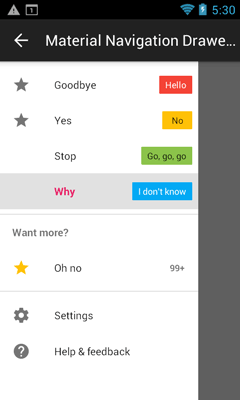
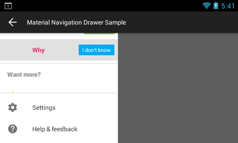
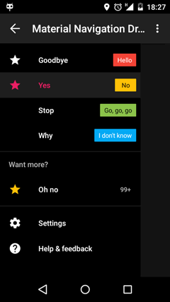
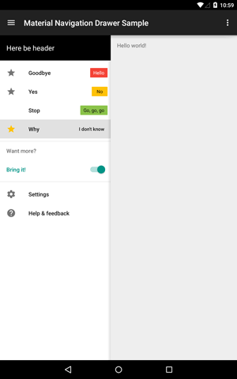
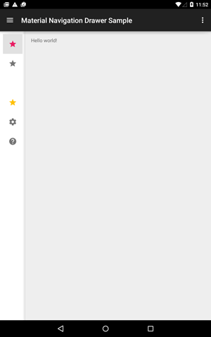
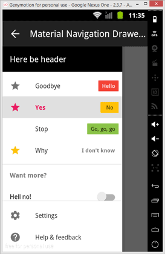
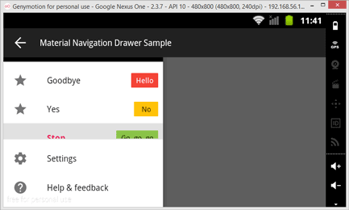

Material Navigation Drawer
==========================

Navigation Drawer according to Material Design spec.

Contains native and support fragments of expanded and collapsed navigation list for use with `DrawerLayout` or Chiu-Ki Chan's `CrossFadeSlidingPaneLayout` (included).

The library is now available from API 4.

How to get the library?
-----------------------

To use this library add the following to your module's `build.gradle`:
```groovy
dependencies {
    compile 'net.xpece.material:navigation-drawer:0.6.0@aar'
}
```

This library depends on NineOldAndroids and support-v4. If the above is not sufficient add this:

```groovy
dependencies {
    compile 'com.android.support:support-v4:22.0.0'
    compile 'com.nineoldandroids:library:2.4.0'
}
```

Default behavior
----------------

 - Icon color defaults to `android:textColorSecondary` when not selected. See `SimpleNavigationItemDescriptor` or `BaseNavigationItemDescriptor`.
 - Text color and selected icon color defaults to 100% white or 87% black based on background. See `SimpleNavigationItemDescriptor` or `BaseNavigationItemDescriptor`.
 - Activated background is set to 12% of `android:colorForeground`. This currently limits the use to white drawer on white theme or black on black.
 - List background is set to `android:colorForegroundInverse` by default. Can be changed via API.
 - Divider color is 12% of `android:colorForeground`. You cannot change this currently.

Customization
-------------

**The drawer has too big right margin!**

As of support-v4 library 21.0.3 there is a hardcoded margin of 64dp in a `DrawerLayout`. Use `NavigationDrawerUtils.fixMinDrawerMargin(DrawerLayout)` to remove this limitation. Use this right after you obtain a drawer layout instance typically in `Activity.onCreate(Bundle)`. Why is this an issue? Specs say the margin should be only 56dp on phones. And it does look better.

**I want the drawer to have a standard width!**

To set proper drawer width according to specs call `NavigationDrawerUtils.setProperNavigationDrawerWidth(View)` on your instance of `NavigationDrawerFragment.getView()`. This is not handled automatically to allow developers to reuse the fragment outside of `DrawerLayout` with custom width.

The width will be one of the following:
- On phones: Smallest screen width minus 56dp, maximum 280dp (5 * 56dp). The width will be the same in both portrait and landscape.
- On tablets: Effectively always 280dp. Because it looks better (on 7" tablet the drawer has less than half screen width). Officially it should be 5 * 64dp = 320dp;

**I want the drawer to have a different background!**

You can modify the navigation drawer background by accessing one of `NavigationDrawerFragment.setBackground*()` methods. Please note that the same background will be used for the pinned section. So if you use the pinned section either use a fully opaque color for background or follow [this SO post](http://stackoverflow.com/a/2782035/2444099) to align your bitmap to bottom. The background is not scrolling (which is not very "material design").

**How do I build sections?**

`NavigationSectionDescriptor`

 - Use `heading(String)` to set optional section heading.
 - Use `addItem(NavigationItemDescriptor)` or `addItems(List<NavigationItemDescriptor>)`. These allow you to chain calls as opposed to standard `List` methods.
 
**How do I build items?**

`BaseNavigationItemDescriptor`

- Use `sticky()` and `notSticky()` to specify whether the item should stay selected on click or not.
- Use `iconResource(int)` to specify a drawable resource. Typically this would be a 24dp by 24dp icon. This gets colored automatically. Width limit is 40dp. A value of `android.R.color.transparent` will result in navigation item with padded text (as if it had an empty icon) and a value of `0` will result in the text being aligned to the left side (no icon at all).
- Use `iconColorAlwaysPassiveOn()` to override the icon color in active state by the passive color.
- Use `text(String)` or `text(int)` to set item label.
- Use `activeColor(int)` and its derivatives to specify color of selected icon and text.
- Use `passiveColor(int)` and its derivatives to specify color of unselected icon. Unselected text always takes color of `android:textColorPrimary`.

`SimpleNavigationItemDescriptor` extends `BaseNavigationItemDescriptor`

- Use `badge(String)` or `badge(int)` to set badge text. Badge will be hidden when supplied value is `null`; Minimum badge width is 40dp and text is center aligned.
- Use `badgeColor(int)` and its derivatives to specify background color of the badge. Text color is calculated automatically.
 
**How do I make custom items?**

Extend either `BaseNavigationItemDescriptor` or `AbsNavigationItemDescriptor`. Both require you to implement method `getLayoutId()` which returns your custom layout resource ID. You also need to implement you own `loadInto(View, boolean)` method which is analogous to adapter's `getView(...)`. Optionally you may override `onViewCreated(View)`.

`AbsNavigationItemDescriptor` handles only selected background. See the `ToggleNavigationItemDescriptor` in sample project.

`BaseNavigationItemDescriptor` allows you to use all the good stuff described in previous section. Your custom layout is required to have a `@id/icon` image view and a `@id/text` text view. It's intended for cases where you need a custom view on the right side of the item (such as in `SimpleNavigationItemDescriptor`).

**How do I employ partially visible collapsed navigation (like Gmail on tablets)?**

 Please see the example project, mainly `res/layout-sw600dp/activity_main.xml` and `MainActivity.java`.
 Only descriptors which implement `GraphicNavigationItemDescriptor` will be painted (both base and simple descriptors comply).

Changelog
---------

**0.6.0**
- Cleaned up and updated dependencies

**0.5.7**
- *FIXED:* `CrossFadeSlidingPaneLayout` now properly propagates clicks to full list below API 11
- *FIXED:* Pinned section background now properly overlays incoming list item views

**0.5.6**
- *FIXED:* Non-clickable headers
- *FIXED:* Pinned section no longer expands to accommodate background image

**0.5.5**
- *FIXED:* Icons in compact mode now get properly colored

**0.5.4**
- *CRITICAL BUG FIX:* Some items failed to set activated background. Not anymore!
- *FIXED:* Null icon items now have no margin as intended.
- *FIXED:* `ToggleNavigationItemDescriptor` in sample project now behaves properly

**0.5.3**
- *FIXED:* `.aar` packaging in POM file specified
- *FIXED:* Currently selected item does not draw selector
- *FIXED:* `setSelectedItem` not selecting proper item when using headers

**0.5.2**
- *NEW!* Support from API 4

**0.5.1**
- *NEW!* Introduced collapsed version of navigation list
- *NEW!* Included Chiu-Ki Chan's [`CrossFadeSlidingPaneLayout`](https://github.com/chiuki/sliding-pane-layout) for convenience (since API 11)
- *CRITICAL BUG FIX:* Header View now works correctly before KITKAT

**0.4.3**
- *NEW!* Introduced custom view types support
- *NEW!* Added native fragment support by `NavigationListFragment`
- Support-v4 fragment accessible under `SupportNavigationListFragment`
- Some changes in API (e.g. `NavigationItemDescriptor` is now `SimpleNavigationItemDescriptor`)
- Changed package name from `net.xpece.materialnavigationdrawer` to `net.xpece.material.navagationdrawer` (so sorry!)
- More changes in package names (even more sorry, this time it's final)
- Utilities made public in `net.xpece.material.navigationdrawer.internal` package
 - Text color calculation based on background
 - Attribute resolution to colors or drawables
 - Drawable tinting
- *CRITICAL BUG FIX:* Certain configurations with pinned section caused the list view go apes**t rendering it unusable.

**0.3.0** *Deleted*
- Item padding is clamped at 16dp even on tablets (everybody does this and it aligns with the back arrow)
- *NEW!* Different text style for badges without background (as in Gmail app)
- Badge minWidth is now 40dp instead of 24dp (as in Gmail app)
- Badge right margin is set to zero to allow the text to be 16dp from the right edge (as in Gmail app)
- Better compatibility with dark themes
 - Pinned section divider is shown when shadow would not be recognizable
 - Default icon color is 100% white on dark themes
 - Added screenshots to `/docs`
- Ability to override icon color through `BaseNavigationItemDescriptor.iconColorAlwaysPassiveOn()`
- Drawer width on phones is now always `smallestWidthDp` minus `56dp` (the `5 * 56dp` limit still applies).

**0.2.2** *Deleted*
- Fixed extra list view spacing when using header views
- Added `NavigationDrawerItem` to callback + some minor API changes
 
**0.2.1** *Deleted*
- Fixed NPE on inflating fragment
- Dropped appcompat-v7 dependency
- *NEW!* Introduced pinned navigation list section
- Updated sample project
- Minor API changes
- Navigation list no longer sets its width automatically to allow more control to developer
 
**0.1.1** *Deleted*
- First release
- Navigation list with multiple sections with optional headings
- Items have a label, optional icon and an optional text badge
- Icon has a passive color, label and icon have an active color
- Badge has background color, text color gets calculated automatically
- Items can remain selected

Work TBD
--------

 - Better API, factories, copying element prototypes
 - Custom passive text color, divider color, activated drawable via `theme`-like attribute

Screenshots
-----------

`JELLYBEAN` light theme

&nbsp;


`LOLLIPOP` light theme

&nbsp;
 

`LOLLIPOP` dark theme

&nbsp;
 

`LOLLIPOP` tablet

&nbsp;
 

`GINGERBREAD`

&nbsp;
 

License
-------
```
Licensed under the Apache License, Version 2.0 (the "License");
you may not use this file except in compliance with the License.
You may obtain a copy of the License at

   http://www.apache.org/licenses/LICENSE-2.0

Unless required by applicable law or agreed to in writing, software
distributed under the License is distributed on an "AS IS" BASIS,
WITHOUT WARRANTIES OR CONDITIONS OF ANY KIND, either express or implied.
See the License for the specific language governing permissions and
limitations under the License.
```
